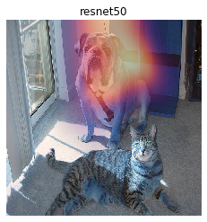

Explaining Keras image classifier predictions
=============================================

If we have a model that takes in an image as input, and outputs a class
score, we can use ELI5 to check what is it in the image that made the
model decide a certain class score. We do that using a method called
'Grad-CAM'.

We will be using images from ImageNet (for more information see
http://image-net.org/), and a classifiers from ``keras.applications``.
This has been tested with Python 3.7.3, Keras 2.2.4, and Tensorflow
1.13.1.

1. Explaining the model's prediction
------------------------------------

To start out, lets load our classifier and data.

.. code:: ipython3

    import keras
    from keras.applications import resnet50
    import eli5
    
    # let's instantiate our model
    resnet = resnet50.ResNet50(include_top=True, weights='imagenet', classes=1000)
    
    # and load our sample image
    image = 'samples/cat_dog.jpg'  # TODO: replace this image with something more interesting
    
    
    # we need to load it as a numpy array
    doc = eli5.keras.image_from_path(image, image_shape=resnet.input_shape[1:3]) # 224x224
    # optional preprocessing specific to resnet
    doc = resnet50.preprocess_input(doc) # note that this operation is in-place
    
    # looking good?
    from PIL import Image
    from IPython.display import display
    display(keras.preprocessing.image.array_to_img(doc[0]))

.. parsed-literal::

    Using TensorFlow backend.

.. parsed-literal::

    WARNING:tensorflow:From /media/tomas/Data/Development/gsoc19_scrapinghub_eli5/envs/eli5_venv_py3.7.3_tf1.13/lib/python3.7/site-packages/tensorflow/python/framework/op_def_library.py:263: colocate_with (from tensorflow.python.framework.ops) is deprecated and will be removed in a future version.
    Instructions for updating:
    Colocations handled automatically by placer.

.. image:: static/keras-image-classifiers/output_1_2.png

Let's classify our image and explain that classification

.. code:: ipython3

    eli5.show_prediction(resnet, doc)

.. parsed-literal::

    Taking top prediction: 243
    WARNING:tensorflow:From /media/tomas/Data/Development/gsoc19_scrapinghub_eli5/envs/eli5_venv_py3.7.3_tf1.13/lib/python3.7/site-packages/tensorflow/python/ops/math_ops.py:3066: to_int32 (from tensorflow.python.ops.math_ops) is deprecated and will be removed in a future version.
    Instructions for updating:
    Use tf.cast instead.

.. image:: static/keras-image-classifiers/output_3_1.png

We can see a highlighted region. This is what influenced the model's
prediction the most.

2. Choosing the target class
----------------------------

We can make the model classify other objects and check where the
classifier looks to make its decisions.

This time we will use the ``eli5.explain_prediction`` and
``eli5.format_as_image`` functions (that are called together by
``eli5.show_prediction``) to better understand what is going on.

.. code:: ipython3

    tiger_cat_idx = 282 # ImageNet id for "tiger_cat" class
    expl = eli5.explain_prediction(resnet, doc, targets=[tiger_cat_idx])

Let's have a look at the explanation

.. code:: ipython3

    display(expl.image)
    display(expl.heatmap)

.. image:: static/keras-image-classifiers/output_8_0.png

.. image:: static/keras-image-classifiers/output_8_1.png

After resizing the heatmap ...

.. code:: ipython3

    display(expl.heatmap.resize((expl.image.height, expl.image.width)))

Now it's clear what is being highlighted. We just need to overlay the
heatmap over the original image. For that we can use the
``eli5.format_as_image`` function.

.. code:: ipython3

    I = eli5.format_as_image(expl)
    display(I)

.. image:: static/keras-image-classifiers/output_12_0.png

``format_as_image`` has a couple of parameters too:

.. code:: ipython3

    import matplotlib.cm
    
    I = eli5.format_as_image(expl, alpha_limit=255., colormap=matplotlib.cm.cividis)
    display(I)

.. image:: static/keras-image-classifiers/output_14_0.png

3. Choosing a hidden layer
--------------------------

Under the hood Grad-CAM takes a hidden layer inside the network and
differentiates it with respect to the output scores. We have the ability
to choose which hidden layer we do our computations on.

Let's check what layers the network consists of:

.. code:: ipython3

    resnet.summary() # check what layers are available

.. parsed-literal::

    __________________________________________________________________________________________________
    Layer (type)                    Output Shape         Param #     Connected to                     
    ==================================================================================================
    input_1 (InputLayer)            (None, 224, 224, 3)  0                                            
    __________________________________________________________________________________________________
    conv1_pad (ZeroPadding2D)       (None, 230, 230, 3)  0           input_1[0][0]                    
    __________________________________________________________________________________________________
    conv1 (Conv2D)                  (None, 112, 112, 64) 9472        conv1_pad[0][0]                  
    __________________________________________________________________________________________________
    bn_conv1 (BatchNormalization)   (None, 112, 112, 64) 256         conv1[0][0]                      
    __________________________________________________________________________________________________

    ...
    
    res5c_branch2b (Conv2D)         (None, 7, 7, 512)    2359808     activation_47[0][0]              
    __________________________________________________________________________________________________
    bn5c_branch2b (BatchNormalizati (None, 7, 7, 512)    2048        res5c_branch2b[0][0]             
    __________________________________________________________________________________________________
    activation_48 (Activation)      (None, 7, 7, 512)    0           bn5c_branch2b[0][0]              
    __________________________________________________________________________________________________
    res5c_branch2c (Conv2D)         (None, 7, 7, 2048)   1050624     activation_48[0][0]              
    __________________________________________________________________________________________________
    bn5c_branch2c (BatchNormalizati (None, 7, 7, 2048)   8192        res5c_branch2c[0][0]             
    __________________________________________________________________________________________________
    add_16 (Add)                    (None, 7, 7, 2048)   0           bn5c_branch2c[0][0]              
                                                                     activation_46[0][0]              
    __________________________________________________________________________________________________
    activation_49 (Activation)      (None, 7, 7, 2048)   0           add_16[0][0]                     
    __________________________________________________________________________________________________
    avg_pool (GlobalAveragePooling2 (None, 2048)         0           activation_49[0][0]              
    __________________________________________________________________________________________________
    fc1000 (Dense)                  (None, 1000)         2049000     avg_pool[0][0]                   
    ==================================================================================================
    Total params: 25,636,712
    Trainable params: 25,583,592
    Non-trainable params: 53,120
    __________________________________________________________________________________________________

Let's pick a few convolutional layers that are 'far apart':

.. code:: ipython3

    for l in ['res2a_branch2b', 'res3d_branch2c', 'res5c_branch2c']:
        eli5.show_prediction(resnet, doc, layer=l)

.. parsed-literal::

    Taking top prediction: 243

.. image:: static/keras-image-classifiers/output_18_1.png

.. parsed-literal::

    Taking top prediction: 243

.. image:: static/keras-image-classifiers/output_18_3.png

.. parsed-literal::

    Taking top prediction: 243

This should make intuitive sense for CNN's. Initial layers detect 'lower
level' features. Finishing layers detect 'high level' features!

4. Comparing explanations of different models
---------------------------------------------

According to the paper at https://arxiv.org/abs/1711.06104, if an
explanation method such as Grad-CAM is good, then explaining different
models should yield different results. Let's verify that by loading
another model and explaining a classification of the same image:

.. code:: ipython3

    from keras.applications import xception
    
    xcept = xception.Xception(include_top=True, weights='imagenet', classes=1000)
    
    doc2 = eli5.keras.image_from_path(image, image_shape=xcept.input_shape[1:3])
    doc2 = xception.preprocess_input(doc2)
    
    eli5.show_prediction(resnet, doc)
    eli5.show_prediction(xcept, doc2)

.. parsed-literal::

    Taking top prediction: 243

.. image:: static/keras-image-classifiers/output_21_1.png

.. parsed-literal::

    Taking top prediction: 243

.. image:: static/keras-image-classifiers/output_21_3.png

The explanations do look different!
