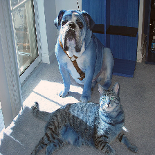
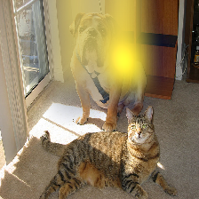

Explaining Keras image classifier predictions
=============================================

If we have a model that takes in an image as input, and outputs a class
score, we can use ELI5 to check what is it in the image that made the
model decide on a certain class. We do that using a method called
'Grad-CAM'.

We will be using images from ImageNet (for more information see
http://image-net.org/), and classifiers from ``keras.applications``.

This has been tested with Python 3.7.3, Keras 2.2.4, and Tensorflow
1.13.1.

1. Explaining the model's prediction
------------------------------------

To start out, lets load our image classifier and data.

.. code:: ipython3

    from PIL import Image
    from IPython.display import display
    
    import logging
    import tensorflow as tf
    tf.get_logger().setLevel(logging.ERROR) # disable Tensorflow warnings for this tutorial
    import warnings
    warnings.simplefilter("ignore") # disable Keras warnings for this tutorial
    import keras
    from keras.applications import mobilenet_v2
    
    import eli5
    
    # let's instantiate our model
    model = mobilenet_v2.MobileNetV2(include_top=True, weights='imagenet', classes=1000)
    
    # and load our sample image
    image = 'imagenet-samples/cat_dog.jpg'  # TODO: replace this image with something more interesting
    
    dims = model.input_shape[1:3] # 224x224
    doc = eli5.keras.image_from_path(image, image_shape=dims)
    doc = mobilenet_v2.preprocess_input(doc) # mobilenetv2-specific preprocessing (this operation is in-place)
    
    # looking good?
    display(keras.preprocessing.image.array_to_img(doc[0]))

.. parsed-literal::

    Using TensorFlow backend.

.. image:: ../_notebooks/static/keras-image-classifiers/output_1_1.png

Let's classify our image and see where the network 'looks' when making
that classification:

.. code:: ipython3

    eli5.show_prediction(model, doc)

.. parsed-literal::

    Taking top prediction: 243

.. image:: ../_notebooks/static/keras-image-classifiers/output_3_1.png

The class ID (index into the output layer) ``243`` stands for
``bull mastiff`` in ImageNet with 1000 classes
(https://gist.github.com/yrevar/942d3a0ac09ec9e5eb3a ). Indeed we have a
dog in the picture. According to Grad-CAM, the area over the dog helped
the model decide this. Makes sense!

2. Choosing the target class (target prediction)
------------------------------------------------

We can make the model classify other objects and check where the
classifier looks to find those objects.

.. code:: ipython3

    cat_idx = 282 # ImageNet ID for "tiger_cat" class, because we have a cat in the picture
    eli5.show_prediction(model, doc, targets=[cat_idx]) # pass the class id

.. image:: ../_notebooks/static/keras-image-classifiers/output_6_0.png

The model looks at the cat now!

We have to pass the class ID as a list to the ``targets`` parameter.

.. code:: ipython3

    window_idx = 904 # 'window screen'
    turtle_idx = 35 # 'mud turtle', some nonsense
    display(eli5.show_prediction(model, doc, targets=[window_idx]))
    display(eli5.show_prediction(model, doc, targets=[turtle_idx]))

.. image:: ../_notebooks/static/keras-image-classifiers/output_8_1.png

That's quite noisy! Perhaps the model is weak at classifying 'window
screens'! The nonsense example could be excused.

Note that we need to wrap ``show_prediction()`` with
``IPython.display.display()`` to actually display the image when
``show_prediction()`` is not the last thing in a cell.

3. Choosing a hidden activation layer
-------------------------------------

Under the hood Grad-CAM takes a hidden layer inside the network and
differentiates it with respect to the output scores. We have the ability
to choose which hidden layer we do our computations on.

Let's check what layers the network consists of:

.. code:: ipython3

    # we could use model.summary() here, but the model has over 100 layers. 
    # we will only look at the first few and last few layers
    
    head = model.layers[:5]
    tail = model.layers[-8:]
    
    def pretty_print_layers(layers):
        for l in layers:
            info = [l.name, type(l).__name__, l.output_shape, l.count_params()]
            pretty_print(info)
    
    def pretty_print(lst):
        s = ',\t'.join(map(str, lst))
        print(s)
    
    pretty_print(['name', 'type', 'output shape', 'param. no'])
    print('-'*100)
    pretty_print([model.input.name, type(model.input), model.input_shape, 0])
    pretty_print_layers(head)
    print()
    print('...')
    print()
    pretty_print_layers(tail)

.. parsed-literal::

    name,	type,	output shape,	param. no
    ----------------------------------------------------------------------------------------------------
    input_1:0,	<class 'tensorflow.python.framework.ops.Tensor'>,	(None, 224, 224, 3),	0
    input_1,	InputLayer,	(None, 224, 224, 3),	0
    Conv1_pad,	ZeroPadding2D,	(None, 225, 225, 3),	0
    Conv1,	Conv2D,	(None, 112, 112, 32),	864
    bn_Conv1,	BatchNormalization,	(None, 112, 112, 32),	128
    Conv1_relu,	ReLU,	(None, 112, 112, 32),	0
    
    ...
    
    block_16_depthwise_relu,	ReLU,	(None, 7, 7, 960),	0
    block_16_project,	Conv2D,	(None, 7, 7, 320),	307200
    block_16_project_BN,	BatchNormalization,	(None, 7, 7, 320),	1280
    Conv_1,	Conv2D,	(None, 7, 7, 1280),	409600
    Conv_1_bn,	BatchNormalization,	(None, 7, 7, 1280),	5120
    out_relu,	ReLU,	(None, 7, 7, 1280),	0
    global_average_pooling2d_1,	GlobalAveragePooling2D,	(None, 1280),	0
    Logits,	Dense,	(None, 1000),	1281000

Rough print but okay. Let's pick a few convolutional layers that are
'far apart' and do Grad-CAM on them:

.. code:: ipython3

    for l in ['block_2_expand', 'block_9_expand', 'Conv_1']:
        print(l)
        display(eli5.show_prediction(model, doc, layer=l)) # we pass the layer as an argument

.. parsed-literal::

    block_2_expand
    Taking top prediction: 243

.. image:: ../_notebooks/static/keras-image-classifiers/output_13_1.png

.. parsed-literal::

    block_9_expand
    Taking top prediction: 243

.. image:: ../_notebooks/static/keras-image-classifiers/output_13_3.png

.. parsed-literal::

    Conv_1
    Taking top prediction: 243

.. image:: ../_notebooks/static/keras-image-classifiers/output_13_5.png

These results should make intuitive sense for Convolutional Neural
Networks. Initial layers detect 'low level' features, ending layers
detect 'high level' features!

The ``layer`` parameter accepts a layer instance, index, name, or None
(get layer automatically) as its arguments. This is where Grad-CAM
builds its heatmap from.

4. Under the hood - ``explain_prediction()`` and ``format_as_image()``
----------------------------------------------------------------------

This time we will use the ``eli5.explain_prediction()`` and
``eli5.format_as_image()`` functions (that are called one after the
other by the convenience function ``eli5.show_prediction()``), so we can
better understand what is going on.

.. code:: ipython3

    expl = eli5.explain_prediction(model, doc)

.. parsed-literal::

    Taking top prediction: 243

.. code:: ipython3

    display(expl.image) # the .image attribute is a PIL image
    print(expl.heatmap) # the .heatmap attribute is a numpy array

.. image:: ../_notebooks/static/keras-image-classifiers/output_18_0.png

.. parsed-literal::

    [[0.         0.34700313 0.8183028  0.8033573  0.9006027  0.11643576
      0.01095222]
     [0.01533252 0.3834123  0.80703676 0.8511705  0.953165   0.28513837
      0.        ]
     [0.0070803  0.20260036 0.7718989  0.7773378  1.         0.3023881
      0.        ]
     [0.         0.04289365 0.44958755 0.30086696 0.2511559  0.06772005
      0.        ]
     [0.01483668 0.         0.         0.         0.         0.00579806
      0.01929005]
     [0.         0.         0.         0.         0.         0.
      0.05308533]
     [0.         0.         0.         0.         0.         0.01124774
      0.06864652]]

Visualizing the heatmap:

.. code:: ipython3

    heatmap_im = eli5.formatters.image.heatmap_to_grayscale(expl.heatmap)
    display(heatmap_im)

.. image:: ../_notebooks/static/keras-image-classifiers/output_20_0.png

That's only 7x7! This is the spatial dimensions of the
activation/feature maps in the last layers of the network. What Grad-CAM
produces is only a rough approximation.

Let's resize the heatmap (we have to pass the heatmap and the image with
the required dimensions as PIL Image objects, and the interpolation
method):

.. code:: ipython3

    heatmap_im = eli5.formatters.image.resize_over(heatmap_im, expl.image, Image.BOX)
    display(heatmap_im)

.. image:: ../_notebooks/static/keras-image-classifiers/output_22_0.png

Now it's clear what is being highlighted. We just need to apply some
colors and overlay the heatmap over the original image, exactly what
``eli5.format_as_image()`` does!

.. code:: ipython3

    I = eli5.format_as_image(expl)
    display(I)

.. image:: ../_notebooks/static/keras-image-classifiers/output_24_0.png

5. Extra arguments to ``format_as_image()``
-------------------------------------------

``format_as_image()`` has a couple of parameters too:

.. code:: ipython3

    import matplotlib.cm
    
    I = eli5.format_as_image(expl, alpha_limit=1., colormap=matplotlib.cm.cividis)
    display(I)

The ``alpha_limit`` argument controls the maximum opacity that the
heatmap pixels should have. It is between 0.0 and 1.0. Low values are
useful for seeing the original image.

The ``colormap`` argument is a function (callable) that does the
colorisation of the heatmap. See ``matplotlib.cm`` for some options.
Pick your favourite color!

Another optional argument is ``interpolation``. The default is
``PIL.Image.LANCZOS`` (shown here). You have already seen
``PIL.Image.BOX``.

6. Removing softmax
-------------------

The original Grad-CAM paper (https://arxiv.org/pdf/1610.02391.pdf)
suggests that we should use the output of the layer before softmax when
doing Grad-CAM. Currently ELI5 simply takes the model as-is. Let's try
and swap the softmax (logits) layer of our current model with a linear
(no activation) layer, and check the explanation:

.. code:: ipython3

    l = model.get_layer(index=-1) # get the last, output layer
    l.activation = keras.activations.linear # swap activation
    
    # save and load back the model as a trick to reload the graph
    model.save('tmp_model_save_rmsoftmax') # note that this creates a file of the model
    model = keras.models.load_model('tmp_model_save_rmsoftmax')
    
    eli5.show_prediction(model, doc)

.. parsed-literal::

    Taking top prediction: 243

.. image:: ../_notebooks/static/keras-image-classifiers/output_30_1.png

We see some slight differences. The activations are brighter. Do
consider swapping out softmax if explanations for your model seem off.

7. Comparing explanations of different models
---------------------------------------------

According to the paper at https://arxiv.org/abs/1711.06104, if an
explanation method such as Grad-CAM is any good, then explaining
different models should yield different results. Let's verify that by
loading another model and explaining a classification of the same image:

.. code:: ipython3

    from keras.applications import nasnet
    
    model2 = nasnet.NASNetMobile(include_top=True, weights='imagenet', classes=1000)
    
    # we reload the image to apply nasnet-specific preprocessing
    doc2 = eli5.keras.image_from_path(image, image_shape=dims)
    doc2 = nasnet.preprocess_input(doc2)
    
    print(model.name)
    display(eli5.show_prediction(model, doc))
    print(model2.name)
    display(eli5.show_prediction(model2, doc2))

.. parsed-literal::

    mobilenetv2_1.00_224
    Taking top prediction: 243

.. image:: ../_notebooks/static/keras-image-classifiers/output_33_1.png

.. parsed-literal::

    NASNet
    Taking top prediction: 243

.. image:: ../_notebooks/static/keras-image-classifiers/output_33_3.png

Wow ``show_prediction()`` is so robust!
