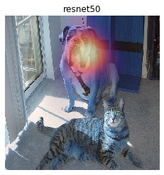

Explaining Keras image classifier predictions
=============================================

If we have a model that takes in an image as input, and outputs a class
score, we can use ELI5 to check what is it in the image that made the
model decide a certain class score. We do that using a method called
'Grad-CAM'.

We will be using images from ImageNet (for more information see
http://image-net.org/), and a classifiers from ``keras.applications``.
This has been tested with Python 3.7.3, Keras 2.2.4, and Tensorflow
1.13.1.

1. Explaining the model's prediction
------------------------------------

To start out, lets load our classifier and data.

.. code:: ipython3

    import keras
    from keras.applications import resnet50
    import eli5
    
    # let's instantiate our model
    resnet = resnet50.ResNet50(include_top=True, weights='imagenet', classes=1000)
    # resnet = keras.applications.mobilenet_v2.MobileNetV2(include_top=True, weights='imagenet', classes=1000)
    
    # and load our sample image
    image = 'samples/cat_dog.jpg'  # TODO: replace this image with something more interesting
    
    
    # we need to load it as a numpy array
    doc = eli5.keras.image_from_path(image, image_shape=resnet.input_shape[1:3]) # 224x224
    # doc = keras.applications.mobilenet_v2.preprocess_input(doc) # note that this operation is in-place
    doc = resnet50.preprocess_input(doc) # optional preprocessing specific to resnet
    
    # looking good?
    from PIL import Image
    from IPython.display import display
    display(keras.preprocessing.image.array_to_img(doc[0]))

.. parsed-literal::

    Using TensorFlow backend.

.. parsed-literal::

    WARNING:tensorflow:From /media/tomas/Data/Development/gsoc19_scrapinghub_eli5/envs/eli5_venv_py3.7.3_tf1.13/lib/python3.7/site-packages/tensorflow/python/framework/op_def_library.py:263: colocate_with (from tensorflow.python.framework.ops) is deprecated and will be removed in a future version.
    Instructions for updating:
    Colocations handled automatically by placer.

.. image:: output_1_2.png

Let's classify our image and explain that classification

.. code:: ipython3

    eli5.show_prediction(resnet, doc)

.. parsed-literal::

    Taking top prediction: 243
    WARNING:tensorflow:From /media/tomas/Data/Development/gsoc19_scrapinghub_eli5/envs/eli5_venv_py3.7.3_tf1.13/lib/python3.7/site-packages/tensorflow/python/ops/math_ops.py:3066: to_int32 (from tensorflow.python.ops.math_ops) is deprecated and will be removed in a future version.
    Instructions for updating:
    Use tf.cast instead.

.. parsed-literal::

    (<Figure size 432x288 with 1 Axes>,
     <matplotlib.axes._subplots.AxesSubplot at 0x7f6c4c52fb38>)

We can see a highlighted region. This is what influenced the model's
prediction the most.

2. Choosing the target class
----------------------------

We can make the model classify other objects and check where the
classifier looks to make its decisions.

This time we will use the ``eli5.explain_prediction`` and
``eli5.format_as_image`` functions (that are called together by
``eli5.show_prediction``) to better understand what is going on.

.. code:: ipython3

    tiger_cat_idx = 282 # ImageNet id for "tiger_cat" class
    expl = eli5.explain_prediction(resnet, doc, targets=[tiger_cat_idx])

Let's have a look at the explanation

.. code:: ipython3

    display(expl.image)
    display(expl.heatmap)

.. image:: output_8_0.png

.. image:: output_8_1.png

After resizing the heatmap ...

.. code:: ipython3

    display(expl.heatmap.resize((expl.image.height, expl.image.width)))

.. image:: output_10_0.png

Now it's clear what is being highlighted. We just need to overlay the
heatmap over the original image. For that we can use the
``eli5.format_as_image`` function.

.. code:: ipython3

    I = eli5.format_as_image(expl)
    display(I)

.. image:: output_12_0.png

``format_as_image`` has a couple of parameters too:

.. code:: ipython3

    import matplotlib.cm
    
    I = eli5.format_as_image(expl, alpha_limit=255., colormap=matplotlib.cm.cividis)
    display(I)

.. image:: output_14_0.png

3. Choosing a hidden layer
--------------------------

Under the hood Grad-CAM takes a hidden layer inside the network and
differentiates it with respect to the output scores. We have the ability
to choose which hidden layer we do our computations on.

Let's check what layers the network consists of:

.. code:: ipython3

    resnet.summary() # check what layers are available

.. parsed-literal::

    __________________________________________________________________________________________________
    Layer (type)                    Output Shape         Param #     Connected to                     
    ==================================================================================================
    input_1 (InputLayer)            (None, 224, 224, 3)  0                                            
    __________________________________________________________________________________________________
    conv1_pad (ZeroPadding2D)       (None, 230, 230, 3)  0           input_1[0][0]                    
    __________________________________________________________________________________________________
    conv1 (Conv2D)                  (None, 112, 112, 64) 9472        conv1_pad[0][0]                  
    __________________________________________________________________________________________________
    bn_conv1 (BatchNormalization)   (None, 112, 112, 64) 256         conv1[0][0]                      
    __________________________________________________________________________________________________
    activation_1 (Activation)       (None, 112, 112, 64) 0           bn_conv1[0][0]                   
    __________________________________________________________________________________________________
    pool1_pad (ZeroPadding2D)       (None, 114, 114, 64) 0           activation_1[0][0]               
    __________________________________________________________________________________________________
    max_pooling2d_1 (MaxPooling2D)  (None, 56, 56, 64)   0           pool1_pad[0][0]                  
    __________________________________________________________________________________________________
    res2a_branch2a (Conv2D)         (None, 56, 56, 64)   4160        max_pooling2d_1[0][0]            
    __________________________________________________________________________________________________
    bn2a_branch2a (BatchNormalizati (None, 56, 56, 64)   256         res2a_branch2a[0][0]             
    __________________________________________________________________________________________________
    activation_2 (Activation)       (None, 56, 56, 64)   0           bn2a_branch2a[0][0]              
    __________________________________________________________________________________________________
    res2a_branch2b (Conv2D)         (None, 56, 56, 64)   36928       activation_2[0][0]               
    __________________________________________________________________________________________________
    bn2a_branch2b (BatchNormalizati (None, 56, 56, 64)   256         res2a_branch2b[0][0]             
    __________________________________________________________________________________________________
    activation_3 (Activation)       (None, 56, 56, 64)   0           bn2a_branch2b[0][0]              
    __________________________________________________________________________________________________
    res2a_branch2c (Conv2D)         (None, 56, 56, 256)  16640       activation_3[0][0]               
    __________________________________________________________________________________________________
    res2a_branch1 (Conv2D)          (None, 56, 56, 256)  16640       max_pooling2d_1[0][0]            
    __________________________________________________________________________________________________
    bn2a_branch2c (BatchNormalizati (None, 56, 56, 256)  1024        res2a_branch2c[0][0]             
    __________________________________________________________________________________________________
    bn2a_branch1 (BatchNormalizatio (None, 56, 56, 256)  1024        res2a_branch1[0][0]              
    __________________________________________________________________________________________________
    add_1 (Add)                     (None, 56, 56, 256)  0           bn2a_branch2c[0][0]              
                                                                     bn2a_branch1[0][0]               
    __________________________________________________________________________________________________
    activation_4 (Activation)       (None, 56, 56, 256)  0           add_1[0][0]                      
    __________________________________________________________________________________________________
    res2b_branch2a (Conv2D)         (None, 56, 56, 64)   16448       activation_4[0][0]               
    __________________________________________________________________________________________________
    bn2b_branch2a (BatchNormalizati (None, 56, 56, 64)   256         res2b_branch2a[0][0]             
    __________________________________________________________________________________________________
    activation_5 (Activation)       (None, 56, 56, 64)   0           bn2b_branch2a[0][0]              
    __________________________________________________________________________________________________
    res2b_branch2b (Conv2D)         (None, 56, 56, 64)   36928       activation_5[0][0]               
    __________________________________________________________________________________________________
    bn2b_branch2b (BatchNormalizati (None, 56, 56, 64)   256         res2b_branch2b[0][0]             
    __________________________________________________________________________________________________
    activation_6 (Activation)       (None, 56, 56, 64)   0           bn2b_branch2b[0][0]              
    __________________________________________________________________________________________________
    res2b_branch2c (Conv2D)         (None, 56, 56, 256)  16640       activation_6[0][0]               
    __________________________________________________________________________________________________
    bn2b_branch2c (BatchNormalizati (None, 56, 56, 256)  1024        res2b_branch2c[0][0]             
    __________________________________________________________________________________________________
    add_2 (Add)                     (None, 56, 56, 256)  0           bn2b_branch2c[0][0]              
                                                                     activation_4[0][0]               
    __________________________________________________________________________________________________
    activation_7 (Activation)       (None, 56, 56, 256)  0           add_2[0][0]                      
    __________________________________________________________________________________________________
    res2c_branch2a (Conv2D)         (None, 56, 56, 64)   16448       activation_7[0][0]               
    __________________________________________________________________________________________________
    bn2c_branch2a (BatchNormalizati (None, 56, 56, 64)   256         res2c_branch2a[0][0]             
    __________________________________________________________________________________________________
    activation_8 (Activation)       (None, 56, 56, 64)   0           bn2c_branch2a[0][0]              
    __________________________________________________________________________________________________
    res2c_branch2b (Conv2D)         (None, 56, 56, 64)   36928       activation_8[0][0]               
    __________________________________________________________________________________________________
    bn2c_branch2b (BatchNormalizati (None, 56, 56, 64)   256         res2c_branch2b[0][0]             
    __________________________________________________________________________________________________
    activation_9 (Activation)       (None, 56, 56, 64)   0           bn2c_branch2b[0][0]              
    __________________________________________________________________________________________________
    res2c_branch2c (Conv2D)         (None, 56, 56, 256)  16640       activation_9[0][0]               
    __________________________________________________________________________________________________
    bn2c_branch2c (BatchNormalizati (None, 56, 56, 256)  1024        res2c_branch2c[0][0]             
    __________________________________________________________________________________________________
    add_3 (Add)                     (None, 56, 56, 256)  0           bn2c_branch2c[0][0]              
                                                                     activation_7[0][0]               
    __________________________________________________________________________________________________
    activation_10 (Activation)      (None, 56, 56, 256)  0           add_3[0][0]                      
    __________________________________________________________________________________________________
    res3a_branch2a (Conv2D)         (None, 28, 28, 128)  32896       activation_10[0][0]              
    __________________________________________________________________________________________________
    bn3a_branch2a (BatchNormalizati (None, 28, 28, 128)  512         res3a_branch2a[0][0]             
    __________________________________________________________________________________________________
    activation_11 (Activation)      (None, 28, 28, 128)  0           bn3a_branch2a[0][0]              
    __________________________________________________________________________________________________
    res3a_branch2b (Conv2D)         (None, 28, 28, 128)  147584      activation_11[0][0]              
    __________________________________________________________________________________________________
    bn3a_branch2b (BatchNormalizati (None, 28, 28, 128)  512         res3a_branch2b[0][0]             
    __________________________________________________________________________________________________
    activation_12 (Activation)      (None, 28, 28, 128)  0           bn3a_branch2b[0][0]              
    __________________________________________________________________________________________________
    res3a_branch2c (Conv2D)         (None, 28, 28, 512)  66048       activation_12[0][0]              
    __________________________________________________________________________________________________
    res3a_branch1 (Conv2D)          (None, 28, 28, 512)  131584      activation_10[0][0]              
    __________________________________________________________________________________________________
    bn3a_branch2c (BatchNormalizati (None, 28, 28, 512)  2048        res3a_branch2c[0][0]             
    __________________________________________________________________________________________________
    bn3a_branch1 (BatchNormalizatio (None, 28, 28, 512)  2048        res3a_branch1[0][0]              
    __________________________________________________________________________________________________
    add_4 (Add)                     (None, 28, 28, 512)  0           bn3a_branch2c[0][0]              
                                                                     bn3a_branch1[0][0]               
    __________________________________________________________________________________________________
    activation_13 (Activation)      (None, 28, 28, 512)  0           add_4[0][0]                      
    __________________________________________________________________________________________________
    res3b_branch2a (Conv2D)         (None, 28, 28, 128)  65664       activation_13[0][0]              
    __________________________________________________________________________________________________
    bn3b_branch2a (BatchNormalizati (None, 28, 28, 128)  512         res3b_branch2a[0][0]             
    __________________________________________________________________________________________________
    activation_14 (Activation)      (None, 28, 28, 128)  0           bn3b_branch2a[0][0]              
    __________________________________________________________________________________________________
    res3b_branch2b (Conv2D)         (None, 28, 28, 128)  147584      activation_14[0][0]              
    __________________________________________________________________________________________________
    bn3b_branch2b (BatchNormalizati (None, 28, 28, 128)  512         res3b_branch2b[0][0]             
    __________________________________________________________________________________________________
    activation_15 (Activation)      (None, 28, 28, 128)  0           bn3b_branch2b[0][0]              
    __________________________________________________________________________________________________
    res3b_branch2c (Conv2D)         (None, 28, 28, 512)  66048       activation_15[0][0]              
    __________________________________________________________________________________________________
    bn3b_branch2c (BatchNormalizati (None, 28, 28, 512)  2048        res3b_branch2c[0][0]             
    __________________________________________________________________________________________________
    add_5 (Add)                     (None, 28, 28, 512)  0           bn3b_branch2c[0][0]              
                                                                     activation_13[0][0]              
    __________________________________________________________________________________________________
    activation_16 (Activation)      (None, 28, 28, 512)  0           add_5[0][0]                      
    __________________________________________________________________________________________________
    res3c_branch2a (Conv2D)         (None, 28, 28, 128)  65664       activation_16[0][0]              
    __________________________________________________________________________________________________
    bn3c_branch2a (BatchNormalizati (None, 28, 28, 128)  512         res3c_branch2a[0][0]             
    __________________________________________________________________________________________________
    activation_17 (Activation)      (None, 28, 28, 128)  0           bn3c_branch2a[0][0]              
    __________________________________________________________________________________________________
    res3c_branch2b (Conv2D)         (None, 28, 28, 128)  147584      activation_17[0][0]              
    __________________________________________________________________________________________________
    bn3c_branch2b (BatchNormalizati (None, 28, 28, 128)  512         res3c_branch2b[0][0]             
    __________________________________________________________________________________________________
    activation_18 (Activation)      (None, 28, 28, 128)  0           bn3c_branch2b[0][0]              
    __________________________________________________________________________________________________
    res3c_branch2c (Conv2D)         (None, 28, 28, 512)  66048       activation_18[0][0]              
    __________________________________________________________________________________________________
    bn3c_branch2c (BatchNormalizati (None, 28, 28, 512)  2048        res3c_branch2c[0][0]             
    __________________________________________________________________________________________________
    add_6 (Add)                     (None, 28, 28, 512)  0           bn3c_branch2c[0][0]              
                                                                     activation_16[0][0]              
    __________________________________________________________________________________________________
    activation_19 (Activation)      (None, 28, 28, 512)  0           add_6[0][0]                      
    __________________________________________________________________________________________________
    res3d_branch2a (Conv2D)         (None, 28, 28, 128)  65664       activation_19[0][0]              
    __________________________________________________________________________________________________
    bn3d_branch2a (BatchNormalizati (None, 28, 28, 128)  512         res3d_branch2a[0][0]             
    __________________________________________________________________________________________________
    activation_20 (Activation)      (None, 28, 28, 128)  0           bn3d_branch2a[0][0]              
    __________________________________________________________________________________________________
    res3d_branch2b (Conv2D)         (None, 28, 28, 128)  147584      activation_20[0][0]              
    __________________________________________________________________________________________________
    bn3d_branch2b (BatchNormalizati (None, 28, 28, 128)  512         res3d_branch2b[0][0]             
    __________________________________________________________________________________________________
    activation_21 (Activation)      (None, 28, 28, 128)  0           bn3d_branch2b[0][0]              
    __________________________________________________________________________________________________
    res3d_branch2c (Conv2D)         (None, 28, 28, 512)  66048       activation_21[0][0]              
    __________________________________________________________________________________________________
    bn3d_branch2c (BatchNormalizati (None, 28, 28, 512)  2048        res3d_branch2c[0][0]             
    __________________________________________________________________________________________________
    add_7 (Add)                     (None, 28, 28, 512)  0           bn3d_branch2c[0][0]              
                                                                     activation_19[0][0]              
    __________________________________________________________________________________________________
    activation_22 (Activation)      (None, 28, 28, 512)  0           add_7[0][0]                      
    __________________________________________________________________________________________________
    res4a_branch2a (Conv2D)         (None, 14, 14, 256)  131328      activation_22[0][0]              
    __________________________________________________________________________________________________
    bn4a_branch2a (BatchNormalizati (None, 14, 14, 256)  1024        res4a_branch2a[0][0]             
    __________________________________________________________________________________________________
    activation_23 (Activation)      (None, 14, 14, 256)  0           bn4a_branch2a[0][0]              
    __________________________________________________________________________________________________
    res4a_branch2b (Conv2D)         (None, 14, 14, 256)  590080      activation_23[0][0]              
    __________________________________________________________________________________________________
    bn4a_branch2b (BatchNormalizati (None, 14, 14, 256)  1024        res4a_branch2b[0][0]             
    __________________________________________________________________________________________________
    activation_24 (Activation)      (None, 14, 14, 256)  0           bn4a_branch2b[0][0]              
    __________________________________________________________________________________________________
    res4a_branch2c (Conv2D)         (None, 14, 14, 1024) 263168      activation_24[0][0]              
    __________________________________________________________________________________________________
    res4a_branch1 (Conv2D)          (None, 14, 14, 1024) 525312      activation_22[0][0]              
    __________________________________________________________________________________________________
    bn4a_branch2c (BatchNormalizati (None, 14, 14, 1024) 4096        res4a_branch2c[0][0]             
    __________________________________________________________________________________________________
    bn4a_branch1 (BatchNormalizatio (None, 14, 14, 1024) 4096        res4a_branch1[0][0]              
    __________________________________________________________________________________________________
    add_8 (Add)                     (None, 14, 14, 1024) 0           bn4a_branch2c[0][0]              
                                                                     bn4a_branch1[0][0]               
    __________________________________________________________________________________________________
    activation_25 (Activation)      (None, 14, 14, 1024) 0           add_8[0][0]                      
    __________________________________________________________________________________________________
    res4b_branch2a (Conv2D)         (None, 14, 14, 256)  262400      activation_25[0][0]              
    __________________________________________________________________________________________________
    bn4b_branch2a (BatchNormalizati (None, 14, 14, 256)  1024        res4b_branch2a[0][0]             
    __________________________________________________________________________________________________
    activation_26 (Activation)      (None, 14, 14, 256)  0           bn4b_branch2a[0][0]              
    __________________________________________________________________________________________________
    res4b_branch2b (Conv2D)         (None, 14, 14, 256)  590080      activation_26[0][0]              
    __________________________________________________________________________________________________
    bn4b_branch2b (BatchNormalizati (None, 14, 14, 256)  1024        res4b_branch2b[0][0]             
    __________________________________________________________________________________________________
    activation_27 (Activation)      (None, 14, 14, 256)  0           bn4b_branch2b[0][0]              
    __________________________________________________________________________________________________
    res4b_branch2c (Conv2D)         (None, 14, 14, 1024) 263168      activation_27[0][0]              
    __________________________________________________________________________________________________
    bn4b_branch2c (BatchNormalizati (None, 14, 14, 1024) 4096        res4b_branch2c[0][0]             
    __________________________________________________________________________________________________
    add_9 (Add)                     (None, 14, 14, 1024) 0           bn4b_branch2c[0][0]              
                                                                     activation_25[0][0]              
    __________________________________________________________________________________________________
    activation_28 (Activation)      (None, 14, 14, 1024) 0           add_9[0][0]                      
    __________________________________________________________________________________________________
    res4c_branch2a (Conv2D)         (None, 14, 14, 256)  262400      activation_28[0][0]              
    __________________________________________________________________________________________________
    bn4c_branch2a (BatchNormalizati (None, 14, 14, 256)  1024        res4c_branch2a[0][0]             
    __________________________________________________________________________________________________
    activation_29 (Activation)      (None, 14, 14, 256)  0           bn4c_branch2a[0][0]              
    __________________________________________________________________________________________________
    res4c_branch2b (Conv2D)         (None, 14, 14, 256)  590080      activation_29[0][0]              
    __________________________________________________________________________________________________
    bn4c_branch2b (BatchNormalizati (None, 14, 14, 256)  1024        res4c_branch2b[0][0]             
    __________________________________________________________________________________________________
    activation_30 (Activation)      (None, 14, 14, 256)  0           bn4c_branch2b[0][0]              
    __________________________________________________________________________________________________
    res4c_branch2c (Conv2D)         (None, 14, 14, 1024) 263168      activation_30[0][0]              
    __________________________________________________________________________________________________
    bn4c_branch2c (BatchNormalizati (None, 14, 14, 1024) 4096        res4c_branch2c[0][0]             
    __________________________________________________________________________________________________
    add_10 (Add)                    (None, 14, 14, 1024) 0           bn4c_branch2c[0][0]              
                                                                     activation_28[0][0]              
    __________________________________________________________________________________________________
    activation_31 (Activation)      (None, 14, 14, 1024) 0           add_10[0][0]                     
    __________________________________________________________________________________________________
    res4d_branch2a (Conv2D)         (None, 14, 14, 256)  262400      activation_31[0][0]              
    __________________________________________________________________________________________________
    bn4d_branch2a (BatchNormalizati (None, 14, 14, 256)  1024        res4d_branch2a[0][0]             
    __________________________________________________________________________________________________
    activation_32 (Activation)      (None, 14, 14, 256)  0           bn4d_branch2a[0][0]              
    __________________________________________________________________________________________________
    res4d_branch2b (Conv2D)         (None, 14, 14, 256)  590080      activation_32[0][0]              
    __________________________________________________________________________________________________
    bn4d_branch2b (BatchNormalizati (None, 14, 14, 256)  1024        res4d_branch2b[0][0]             
    __________________________________________________________________________________________________
    activation_33 (Activation)      (None, 14, 14, 256)  0           bn4d_branch2b[0][0]              
    __________________________________________________________________________________________________
    res4d_branch2c (Conv2D)         (None, 14, 14, 1024) 263168      activation_33[0][0]              
    __________________________________________________________________________________________________
    bn4d_branch2c (BatchNormalizati (None, 14, 14, 1024) 4096        res4d_branch2c[0][0]             
    __________________________________________________________________________________________________
    add_11 (Add)                    (None, 14, 14, 1024) 0           bn4d_branch2c[0][0]              
                                                                     activation_31[0][0]              
    __________________________________________________________________________________________________
    activation_34 (Activation)      (None, 14, 14, 1024) 0           add_11[0][0]                     
    __________________________________________________________________________________________________
    res4e_branch2a (Conv2D)         (None, 14, 14, 256)  262400      activation_34[0][0]              
    __________________________________________________________________________________________________
    bn4e_branch2a (BatchNormalizati (None, 14, 14, 256)  1024        res4e_branch2a[0][0]             
    __________________________________________________________________________________________________
    activation_35 (Activation)      (None, 14, 14, 256)  0           bn4e_branch2a[0][0]              
    __________________________________________________________________________________________________
    res4e_branch2b (Conv2D)         (None, 14, 14, 256)  590080      activation_35[0][0]              
    __________________________________________________________________________________________________
    bn4e_branch2b (BatchNormalizati (None, 14, 14, 256)  1024        res4e_branch2b[0][0]             
    __________________________________________________________________________________________________
    activation_36 (Activation)      (None, 14, 14, 256)  0           bn4e_branch2b[0][0]              
    __________________________________________________________________________________________________
    res4e_branch2c (Conv2D)         (None, 14, 14, 1024) 263168      activation_36[0][0]              
    __________________________________________________________________________________________________
    bn4e_branch2c (BatchNormalizati (None, 14, 14, 1024) 4096        res4e_branch2c[0][0]             
    __________________________________________________________________________________________________
    add_12 (Add)                    (None, 14, 14, 1024) 0           bn4e_branch2c[0][0]              
                                                                     activation_34[0][0]              
    __________________________________________________________________________________________________
    activation_37 (Activation)      (None, 14, 14, 1024) 0           add_12[0][0]                     
    __________________________________________________________________________________________________
    res4f_branch2a (Conv2D)         (None, 14, 14, 256)  262400      activation_37[0][0]              
    __________________________________________________________________________________________________
    bn4f_branch2a (BatchNormalizati (None, 14, 14, 256)  1024        res4f_branch2a[0][0]             
    __________________________________________________________________________________________________
    activation_38 (Activation)      (None, 14, 14, 256)  0           bn4f_branch2a[0][0]              
    __________________________________________________________________________________________________
    res4f_branch2b (Conv2D)         (None, 14, 14, 256)  590080      activation_38[0][0]              
    __________________________________________________________________________________________________
    bn4f_branch2b (BatchNormalizati (None, 14, 14, 256)  1024        res4f_branch2b[0][0]             
    __________________________________________________________________________________________________
    activation_39 (Activation)      (None, 14, 14, 256)  0           bn4f_branch2b[0][0]              
    __________________________________________________________________________________________________
    res4f_branch2c (Conv2D)         (None, 14, 14, 1024) 263168      activation_39[0][0]              
    __________________________________________________________________________________________________
    bn4f_branch2c (BatchNormalizati (None, 14, 14, 1024) 4096        res4f_branch2c[0][0]             
    __________________________________________________________________________________________________
    add_13 (Add)                    (None, 14, 14, 1024) 0           bn4f_branch2c[0][0]              
                                                                     activation_37[0][0]              
    __________________________________________________________________________________________________
    activation_40 (Activation)      (None, 14, 14, 1024) 0           add_13[0][0]                     
    __________________________________________________________________________________________________
    res5a_branch2a (Conv2D)         (None, 7, 7, 512)    524800      activation_40[0][0]              
    __________________________________________________________________________________________________
    bn5a_branch2a (BatchNormalizati (None, 7, 7, 512)    2048        res5a_branch2a[0][0]             
    __________________________________________________________________________________________________
    activation_41 (Activation)      (None, 7, 7, 512)    0           bn5a_branch2a[0][0]              
    __________________________________________________________________________________________________
    res5a_branch2b (Conv2D)         (None, 7, 7, 512)    2359808     activation_41[0][0]              
    __________________________________________________________________________________________________
    bn5a_branch2b (BatchNormalizati (None, 7, 7, 512)    2048        res5a_branch2b[0][0]             
    __________________________________________________________________________________________________
    activation_42 (Activation)      (None, 7, 7, 512)    0           bn5a_branch2b[0][0]              
    __________________________________________________________________________________________________
    res5a_branch2c (Conv2D)         (None, 7, 7, 2048)   1050624     activation_42[0][0]              
    __________________________________________________________________________________________________
    res5a_branch1 (Conv2D)          (None, 7, 7, 2048)   2099200     activation_40[0][0]              
    __________________________________________________________________________________________________
    bn5a_branch2c (BatchNormalizati (None, 7, 7, 2048)   8192        res5a_branch2c[0][0]             
    __________________________________________________________________________________________________
    bn5a_branch1 (BatchNormalizatio (None, 7, 7, 2048)   8192        res5a_branch1[0][0]              
    __________________________________________________________________________________________________
    add_14 (Add)                    (None, 7, 7, 2048)   0           bn5a_branch2c[0][0]              
                                                                     bn5a_branch1[0][0]               
    __________________________________________________________________________________________________
    activation_43 (Activation)      (None, 7, 7, 2048)   0           add_14[0][0]                     
    __________________________________________________________________________________________________
    res5b_branch2a (Conv2D)         (None, 7, 7, 512)    1049088     activation_43[0][0]              
    __________________________________________________________________________________________________
    bn5b_branch2a (BatchNormalizati (None, 7, 7, 512)    2048        res5b_branch2a[0][0]             
    __________________________________________________________________________________________________
    activation_44 (Activation)      (None, 7, 7, 512)    0           bn5b_branch2a[0][0]              
    __________________________________________________________________________________________________
    res5b_branch2b (Conv2D)         (None, 7, 7, 512)    2359808     activation_44[0][0]              
    __________________________________________________________________________________________________
    bn5b_branch2b (BatchNormalizati (None, 7, 7, 512)    2048        res5b_branch2b[0][0]             
    __________________________________________________________________________________________________
    activation_45 (Activation)      (None, 7, 7, 512)    0           bn5b_branch2b[0][0]              
    __________________________________________________________________________________________________
    res5b_branch2c (Conv2D)         (None, 7, 7, 2048)   1050624     activation_45[0][0]              
    __________________________________________________________________________________________________
    bn5b_branch2c (BatchNormalizati (None, 7, 7, 2048)   8192        res5b_branch2c[0][0]             
    __________________________________________________________________________________________________
    add_15 (Add)                    (None, 7, 7, 2048)   0           bn5b_branch2c[0][0]              
                                                                     activation_43[0][0]              
    __________________________________________________________________________________________________
    activation_46 (Activation)      (None, 7, 7, 2048)   0           add_15[0][0]                     
    __________________________________________________________________________________________________
    res5c_branch2a (Conv2D)         (None, 7, 7, 512)    1049088     activation_46[0][0]              
    __________________________________________________________________________________________________
    bn5c_branch2a (BatchNormalizati (None, 7, 7, 512)    2048        res5c_branch2a[0][0]             
    __________________________________________________________________________________________________
    activation_47 (Activation)      (None, 7, 7, 512)    0           bn5c_branch2a[0][0]              
    __________________________________________________________________________________________________
    res5c_branch2b (Conv2D)         (None, 7, 7, 512)    2359808     activation_47[0][0]              
    __________________________________________________________________________________________________
    bn5c_branch2b (BatchNormalizati (None, 7, 7, 512)    2048        res5c_branch2b[0][0]             
    __________________________________________________________________________________________________
    activation_48 (Activation)      (None, 7, 7, 512)    0           bn5c_branch2b[0][0]              
    __________________________________________________________________________________________________
    res5c_branch2c (Conv2D)         (None, 7, 7, 2048)   1050624     activation_48[0][0]              
    __________________________________________________________________________________________________
    bn5c_branch2c (BatchNormalizati (None, 7, 7, 2048)   8192        res5c_branch2c[0][0]             
    __________________________________________________________________________________________________
    add_16 (Add)                    (None, 7, 7, 2048)   0           bn5c_branch2c[0][0]              
                                                                     activation_46[0][0]              
    __________________________________________________________________________________________________
    activation_49 (Activation)      (None, 7, 7, 2048)   0           add_16[0][0]                     
    __________________________________________________________________________________________________
    avg_pool (GlobalAveragePooling2 (None, 2048)         0           activation_49[0][0]              
    __________________________________________________________________________________________________
    fc1000 (Dense)                  (None, 1000)         2049000     avg_pool[0][0]                   
    ==================================================================================================
    Total params: 25,636,712
    Trainable params: 25,583,592
    Non-trainable params: 53,120
    __________________________________________________________________________________________________

Let's pick a few 'spread out' layers:

.. code:: ipython3

    for l in ['res2a_branch2b', 'res3d_branch2c', 'res5c_branch2c']:
        eli5.show_prediction(resnet, doc, layer=l)

.. parsed-literal::

    Taking top prediction: 243

.. parsed-literal::

    Taking top prediction: 243

.. image:: output_18_3.png

.. parsed-literal::

    Taking top prediction: 243

.. image:: output_18_5.png

This should make intuitive sense for CNN's. Initial layers detect 'lower
level' features. Finishing layers detect 'high level' features!

4. Comparing explanations of different models
---------------------------------------------

According to the paper at https://arxiv.org/abs/1711.06104, if an
explanation method such as Grad-CAM is good, then explaining different
models should yield different results. Let's verify that by loading
another model and explaining a classification of the same image:

.. code:: ipython3

    from keras.applications import xception
    
    xcept = xception.Xception(include_top=True, weights='imagenet', classes=1000)
    # xcept = keras.applications.nasnet.NASNetMobile(include_top=True, weights='imagenet', classes=1000)
    
    # doc2 = xception.preprocess_input(im) # xception specific preprocessing
    # doc = eli5.keras.image_from_path(image, image_shape=dims)
    # doc = keras.applications.mobilenet_v2.preprocess_input(doc)
    
    doc2 = eli5.keras.image_from_path(image, image_shape=xcept.input_shape[1:3])
    # doc2 = keras.applications.nasnet.preprocess_input(doc2)
    doc2 = xception.preprocess_input(doc2)
    
    eli5.show_prediction(resnet, doc)
    eli5.show_prediction(xcept, doc2)

.. parsed-literal::

    Taking top prediction: 243

.. image:: output_21_1.png

.. parsed-literal::

    Taking top prediction: 243

.. image:: output_21_3.png

.. parsed-literal::

    (<Figure size 432x288 with 1 Axes>,
     <matplotlib.axes._subplots.AxesSubplot at 0x7f6c24c89898>)

Looks good!
