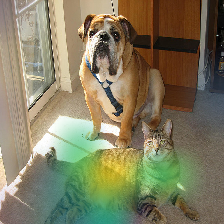
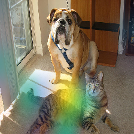

Explaining Keras image classifier predictions with Grad-CAM
===========================================================

If we have a model that takes in an image as its input, and outputs
class scores, i.e. probabilities that a certain object is present in the
image, then we can use ELI5 to check what is it in the image that made
the model predict a certain class score. We do that using a method
called 'Grad-CAM' (https://arxiv.org/abs/1610.02391).

We will be using images from ImageNet (http://image-net.org/), and
classifiers from ``keras.applications``.

This has been tested with Python 3.7.3, Keras 2.2.4, and Tensorflow
1.13.1.

1. Loading our model and data
-----------------------------

To start out, let's get our modules in place

.. code:: ipython3

    from PIL import Image
    from IPython.display import display
    import numpy as np
    
    # you may want to keep logging enabled when doing your own work
    import logging
    import tensorflow as tf
    tf.get_logger().setLevel(logging.ERROR) # disable Tensorflow warnings for this tutorial
    import warnings
    warnings.simplefilter("ignore") # disable Keras warnings for this tutorial
    import keras
    from keras.applications import mobilenet_v2
    
    import eli5

.. parsed-literal::

    Using TensorFlow backend.

And load our image classifier (a light-weight model from
``keras.applications``).

.. code:: ipython3

    model = mobilenet_v2.MobileNetV2(include_top=True, weights='imagenet', classes=1000)
    
    # check the input format
    print(model.input_shape)
    dims = model.input_shape[1:3] # -> (height, width)
    print(dims)

.. parsed-literal::

    (None, 224, 224, 3)
    (224, 224)

We see that we need a numpy tensor of shape (batches, height, width,
channels), with the specified height and width.

Loading our sample image:

.. code:: ipython3

    # we start from a path / URI. 
    # If you already have an image loaded, follow the subsequent steps
    image = 'imagenet-samples/cat_dog.jpg'
    
    # this is the original "cat dog" image used in the Grad-CAM paper
    # check the image with Pillow
    im = Image.open(image)
    print(type(im))
    display(im)

.. parsed-literal::

    <class 'PIL.JpegImagePlugin.JpegImageFile'>

.. image:: ../_notebooks/keras-image-classifiers_files/keras-image-classifiers_5_1.png

We see that this image will need some preprocessing to have the correct
dimensions! Let's resize it:

.. code:: ipython3

    # we could resize the image manually
    # but instead let's use a utility function from `keras.preprocessing`
    # we pass the required dimensions as a (height, width) tuple
    im = keras.preprocessing.image.load_img(image, target_size=dims) # -> PIL image
    print(type(im))
    display(im)

.. parsed-literal::

    <class 'PIL.Image.Image'>

.. image:: ../_notebooks/keras-image-classifiers_files/keras-image-classifiers_7_1.png

Looking good. Now we need to convert the image to a numpy array.

.. code:: ipython3

    # we use a routine from `keras.preprocessing` for that as well
    # we get a 'doc', an object almost ready to be inputted into the model
    
    doc = keras.preprocessing.image.img_to_array(im) # -> numpy array
    print(type(doc), doc.shape)

.. parsed-literal::

    <class 'numpy.ndarray'> (224, 224, 3)

.. code:: ipython3

    # dimensions are looking good
    # except that we are missing one thing - the batch size
    
    # we can use a numpy routine to create an axis in the first position
    doc = np.expand_dims(doc, axis=0)
    print(type(doc), doc.shape)

.. parsed-literal::

    <class 'numpy.ndarray'> (1, 224, 224, 3)

.. code:: ipython3

    # one last thing
    # `keras.applications` models come with their own input preprocessing function
    # for best results, apply that as well
    
    # mobilenetv2-specific preprocessing
    # (this operation is in-place)
    mobilenet_v2.preprocess_input(doc)
    print(type(doc), doc.shape)

.. parsed-literal::

    <class 'numpy.ndarray'> (1, 224, 224, 3)

Let's convert back the array to an image just to check what we are
inputting

.. code:: ipython3

    # take back the first image from our 'batch'
    display(keras.preprocessing.image.array_to_img(doc[0]))

.. image:: ../_notebooks/keras-image-classifiers_files/keras-image-classifiers_13_0.png

Ready to go!

2. Explaining our model's prediction
------------------------------------

Let's classify our image and see where the network 'looks' when making
that classification:

.. code:: ipython3

    # make a prediction about our sample image
    predictions = model.predict(doc)
    print(type(predictions), predictions.shape)

.. parsed-literal::

    <class 'numpy.ndarray'> (1, 1000)

.. code:: ipython3

    # check the top 5 indices
    # `keras.applications` contains a function for that
    
    top = mobilenet_v2.decode_predictions(predictions)
    top_indices = np.argsort(predictions)[0, ::-1][:5]
    
    print(top)
    print(top_indices)

.. parsed-literal::

    [[('n02108422', 'bull_mastiff', 0.80967486), ('n02108089', 'boxer', 0.09835993), ('n02123045', 'tabby', 0.006650372), ('n02123159', 'tiger_cat', 0.004808707), ('n02110958', 'pug', 0.0039409893)]]
    [243 242 281 282 254]

Indeed there is a dog in that picture The class ID (index into the
output layer) ``243`` stands for ``bull mastiff`` in ImageNet with 1000
classes (https://gist.github.com/yrevar/942d3a0ac09ec9e5eb3a ).

But how did the network know that? Let's check where the model "looked"
for a dog with ELI5:

.. code:: ipython3

    eli5.show_prediction(model, doc)

.. image:: ../_notebooks/keras-image-classifiers_files/keras-image-classifiers_19_0.png

The dog region is highlighted. Makes sense!

Note that here we made a prediction twice. Once when looking at top
predictions, and a second time when passing the model through ELI5.

3. Choosing the target class (target prediction)
------------------------------------------------

We can make the model classify other objects and check where the
classifier looks to find those objects.

.. code:: ipython3

    cat_idx = 282 # ImageNet ID for "tiger_cat" class, because we have a cat in the picture
    eli5.show_prediction(model, doc, targets=[cat_idx]) # pass the class id

.. image:: ../_notebooks/keras-image-classifiers_files/keras-image-classifiers_22_0.png

The model looks at the cat now!

We have to pass the class ID as a list to the ``targets`` parameter.
Currently only one class can be explained at a time.

.. code:: ipython3

    window_idx = 904 # 'window screen'
    turtle_idx = 35 # 'mud turtle', some nonsense
    display(eli5.show_prediction(model, doc, targets=[window_idx]))
    display(eli5.show_prediction(model, doc, targets=[turtle_idx]))

.. image:: ../_notebooks/keras-image-classifiers_files/keras-image-classifiers_24_0.png

.. image:: ../_notebooks/keras-image-classifiers_files/keras-image-classifiers_24_1.png

That's quite noisy! Perhaps the model is weak at classifying 'window
screens'! On the other hand the nonsense 'turtle' example could be
excused.

Note that we need to wrap ``show_prediction()`` with
``IPython.display.display()`` to actually display the image when
``show_prediction()`` is not the last thing in a cell.

4. Choosing a hidden activation layer
-------------------------------------

Under the hood Grad-CAM takes a hidden layer inside the network and
differentiates it with respect to the output scores. We have the ability
to choose which hidden layer we do our computations on.

Let's check what layers the network consists of:

.. code:: ipython3

    # we could use model.summary() here, but the model has over 100 layers. 
    # we will only look at the first few and last few layers
    
    head = model.layers[:5]
    tail = model.layers[-8:]
    
    def pretty_print_layers(layers):
        for l in layers:
            info = [l.name, type(l).__name__, l.output_shape, l.count_params()]
            pretty_print(info)
    
    def pretty_print(lst):
        s = ',\t'.join(map(str, lst))
        print(s)
    
    pretty_print(['name', 'type', 'output shape', 'param. no'])
    print('-'*100)
    pretty_print([model.input.name, type(model.input), model.input_shape, 0])
    pretty_print_layers(head)
    print()
    print('...')
    print()
    pretty_print_layers(tail)

.. parsed-literal::

    name,	type,	output shape,	param. no
    ----------------------------------------------------------------------------------------------------
    input_1:0,	<class 'tensorflow.python.framework.ops.Tensor'>,	(None, 224, 224, 3),	0
    input_1,	InputLayer,	(None, 224, 224, 3),	0
    Conv1_pad,	ZeroPadding2D,	(None, 225, 225, 3),	0
    Conv1,	Conv2D,	(None, 112, 112, 32),	864
    bn_Conv1,	BatchNormalization,	(None, 112, 112, 32),	128
    Conv1_relu,	ReLU,	(None, 112, 112, 32),	0
    
    ...
    
    block_16_depthwise_relu,	ReLU,	(None, 7, 7, 960),	0
    block_16_project,	Conv2D,	(None, 7, 7, 320),	307200
    block_16_project_BN,	BatchNormalization,	(None, 7, 7, 320),	1280
    Conv_1,	Conv2D,	(None, 7, 7, 1280),	409600
    Conv_1_bn,	BatchNormalization,	(None, 7, 7, 1280),	5120
    out_relu,	ReLU,	(None, 7, 7, 1280),	0
    global_average_pooling2d_1,	GlobalAveragePooling2D,	(None, 1280),	0
    Logits,	Dense,	(None, 1000),	1281000

Rough print but okay. Let's pick a few convolutional layers that are
'far apart' and do Grad-CAM on them:

.. code:: ipython3

    for l in ['block_2_expand', 'block_9_expand', 'Conv_1']:
        print(l)
        display(eli5.show_prediction(model, doc, layer=l)) # we pass the layer as an argument

.. parsed-literal::

    block_2_expand

.. image:: ../_notebooks/keras-image-classifiers_files/keras-image-classifiers_29_1.png

.. parsed-literal::

    block_9_expand

.. image:: ../_notebooks/keras-image-classifiers_files/keras-image-classifiers_29_3.png

.. parsed-literal::

    Conv_1

.. image:: ../_notebooks/keras-image-classifiers_files/keras-image-classifiers_29_5.png

These results should make intuitive sense for Convolutional Neural
Networks. Initial layers detect 'low level' features, ending layers
detect 'high level' features!

The ``layer`` parameter accepts a layer instance, index, name, or None
(get layer automatically) as its arguments. This is where Grad-CAM
builds its heatmap from.

5. Under the hood - ``explain_prediction()`` and ``format_as_image()``
----------------------------------------------------------------------

This time we will use the ``eli5.explain_prediction()`` and
``eli5.format_as_image()`` functions (that are called one after the
other by the convenience function ``eli5.show_prediction()``), so we can
better understand what is going on.

.. code:: ipython3

    expl = eli5.explain_prediction(model, doc)

Examining the structure of the ``Explanation`` object:

.. code:: ipython3

    print(expl)

.. parsed-literal::

    Explanation(estimator='mobilenetv2_1.00_224', description='Grad-CAM visualization for image classification; \noutput is explanation object that contains input image \nand heatmap image for a target.\n', error='', method='Grad-CAM', is_regression=False, targets=[TargetExplanation(target=243, feature_weights=None, proba=0.80967486, score=None, weighted_spans=None, heatmap=array([[0.        , 0.34700299, 0.81830269, 0.80335707, 0.90060232,
            0.11643575, 0.01095222],
           [0.01533252, 0.38341222, 0.80703666, 0.85117042, 0.95316512,
            0.28513835, 0.        ],
           [0.0070803 , 0.20260035, 0.77189877, 0.77733782, 0.99999996,
            0.30238817, 0.        ],
           [0.        , 0.04289364, 0.44958732, 0.30086692, 0.25115591,
            0.06772003, 0.        ],
           [0.01483668, 0.        , 0.        , 0.        , 0.        ,
            0.00579807, 0.01929005],
           [0.        , 0.        , 0.        , 0.        , 0.        ,
            0.        , 0.05308532],
           [0.        , 0.        , 0.        , 0.        , 0.        ,
            0.01124774, 0.06864653]]))], feature_importances=None, decision_tree=None, highlight_spaces=None, transition_features=None, image=<PIL.Image.Image image mode=RGBA size=224x224 at 0x7F4C52B9EEF0>)

We can check the score (raw value) or probability (normalized score) of
the neuron for the predicted class, and get the class ID itself:

.. code:: ipython3

    # access the score and probability values as attributes of a target
    # for each target (default is 1) we have an entry in the targets list
    print((expl.targets[0].target, expl.targets[0].score, expl.targets[0].proba))

.. parsed-literal::

    (243, None, 0.80967486)

We can also access the original image and the Grad-CAM produced heatmap:

.. code:: ipython3

    image = expl.image
    heatmap = expl.targets[0].heatmap
    
    display(image) # the .image attribute is a PIL image
    print(heatmap) # the .heatmap attribute is a numpy array

.. parsed-literal::

    [[0.         0.34700299 0.81830269 0.80335707 0.90060232 0.11643575
      0.01095222]
     [0.01533252 0.38341222 0.80703666 0.85117042 0.95316512 0.28513835
      0.        ]
     [0.0070803  0.20260035 0.77189877 0.77733782 0.99999996 0.30238817
      0.        ]
     [0.         0.04289364 0.44958732 0.30086692 0.25115591 0.06772003
      0.        ]
     [0.01483668 0.         0.         0.         0.         0.00579807
      0.01929005]
     [0.         0.         0.         0.         0.         0.
      0.05308532]
     [0.         0.         0.         0.         0.         0.01124774
      0.06864653]]

Visualizing the heatmap:

.. code:: ipython3

    heatmap_im = eli5.formatters.image.heatmap_to_image(heatmap)
    display(heatmap_im)

That's only 7x7! This is the spatial dimensions of the
activation/feature maps in the last layers of the network. What Grad-CAM
produces is only a rough approximation.

Let's resize the heatmap (we have to pass the heatmap and the image with
the required dimensions as Pillow images, and the interpolation method):

.. code:: ipython3

    heatmap_im = eli5.formatters.image.expand_heatmap(heatmap, image, Image.BOX)
    display(heatmap_im)

Now it's clear what is being highlighted. We just need to apply some
colors and overlay the heatmap over the original image, exactly what
``eli5.format_as_image()`` does!

.. code:: ipython3

    I = eli5.format_as_image(expl)
    display(I)

.. image:: ../_notebooks/keras-image-classifiers_files/keras-image-classifiers_45_0.png

6. Extra arguments to ``format_as_image()``
-------------------------------------------

``format_as_image()`` has a couple of parameters too:

.. code:: ipython3

    import matplotlib.cm
    
    I = eli5.format_as_image(expl, alpha_limit=1.0, colormap=matplotlib.cm.cividis)
    display(I)

.. image:: ../_notebooks/keras-image-classifiers_files/keras-image-classifiers_48_0.png

The ``alpha_limit`` argument controls the maximum opacity that the
heatmap pixels should have. It is between 0.0 and 1.0. Low values are
useful for seeing the original image.

The ``colormap`` argument is a function (callable) that does the
colorisation of the heatmap. See ``matplotlib.cm`` for some options.
Pick your favourite color!

Another optional argument is ``interpolation``. The default is
``PIL.Image.LANCZOS`` (shown here). You have already seen
``PIL.Image.BOX``.

7. Removing softmax
-------------------

The original Grad-CAM paper (https://arxiv.org/pdf/1610.02391.pdf)
suggests that we should use the output of the layer before softmax when
doing Grad-CAM (use raw score values, not probabilities). Currently ELI5
simply takes the model as-is. Let's try and swap the softmax (logits)
layer of our current model with a linear (no activation) layer, and
check the explanation:

.. code:: ipython3

    # first check the explanation *with* softmax
    print('with softmax')
    display(eli5.show_prediction(model, doc))
    
    
    # remove softmax
    l = model.get_layer(index=-1) # get the last (output) layer
    l.activation = keras.activations.linear # swap activation
    
    # save and load back the model as a trick to reload the graph
    model.save('tmp_model_save_rmsoftmax') # note that this creates a file of the model
    model = keras.models.load_model('tmp_model_save_rmsoftmax')
    
    print('without softmax')
    display(eli5.show_prediction(model, doc))

.. parsed-literal::

    with softmax

.. image:: ../_notebooks/keras-image-classifiers_files/keras-image-classifiers_51_1.png

.. parsed-literal::

    without softmax

.. image:: ../_notebooks/keras-image-classifiers_files/keras-image-classifiers_51_3.png

We see some slight differences. The activations are brighter. Do
consider swapping out softmax if explanations for your model seem off.

8. Comparing explanations of different models
---------------------------------------------

According to the paper at https://arxiv.org/abs/1711.06104, if an
explanation method such as Grad-CAM is any good, then explaining
different models should yield different results. Let's verify that by
loading another model and explaining a classification of the same image:

.. code:: ipython3

    from keras.applications import nasnet
    
    model2 = nasnet.NASNetMobile(include_top=True, weights='imagenet', classes=1000)
    
    # we reload the image array to apply nasnet-specific preprocessing
    doc2 = keras.preprocessing.image.img_to_array(im)
    doc2 = np.expand_dims(doc2, axis=0)
    nasnet.preprocess_input(doc2)
    
    print(model.name)
    display(eli5.show_prediction(model, doc))
    print(model2.name)
    display(eli5.show_prediction(model2, doc2))

.. parsed-literal::

    mobilenetv2_1.00_224

.. image:: ../_notebooks/keras-image-classifiers_files/keras-image-classifiers_54_1.png

.. parsed-literal::

    NASNet

.. image:: ../_notebooks/keras-image-classifiers_files/keras-image-classifiers_54_3.png

Wow ``show_prediction()`` is so robust!
