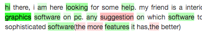

.. _library-scikit-learn:

scikit-learn
============

ELI5 supports many estimators, transformers and other components
from the scikit-learn_ library.

.. _scikit-learn: https://github.com/scikit-learn/scikit-learn

.. _sklearn-additional-kwargs:

Additional ``explain_weights`` and ``explain_prediction`` parameters
--------------------------------------------------------------------

For all supported scikit-learn classifiers and regressors
:func:`eli5.explain_weights` and :func:`eli5.explain_prediction` accept
additional keyword arguments. Additional :func:`eli5.explain_weights`
parameters:

* ``vec`` is a vectorizer instance used to transform
  raw features to the input of the classifier or regressor
  (e.g. a fitted CountVectorizer instance); you can pass it
  instead of ``feature_names``.

Additional :func:`eli5.explain_prediction` parameters:

* ``vec`` is a vectorizer instance used to transform
  raw features to the input of the classifier or regressor
  (e.g. a fitted CountVectorizer instance); you can pass it
  instead of ``feature_names``.

* ``vectorized`` is a flag which tells eli5 if ``doc`` should be
  passed through ``vec`` or not. By default it is False, meaning that
  if ``vec`` is not None, ``vec.transform([doc])`` is passed to the
  estimator. Set it to True if you're passing ``vec`` (e.g. to get feature
  names and/or enable :ref:`text highlighting <sklearn-text-highlighting>`),
  but ``doc`` is already vectorized.

.. _sklearn-linear-estimators:

Linear estimators
-----------------

For linear estimators eli5 maps coefficients back to feature names directly.
Supported estimators from `sklearn.linear_model`_:

* ElasticNet_
* ElasticNetCV_
* HuberRegressor_
* Lars_
* LarsCV_
* Lasso_
* LassoCV_
* LassoLars_
* LassoLarsCV_
* LassoLarsIC_
* LinearRegression_
* LogisticRegression_
* LogisticRegressionCV_
* OrthogonalMatchingPursuit_
* OrthogonalMatchingPursuitCV_
* PassiveAggressiveClassifier_
* PassiveAggressiveRegressor_
* Perceptron_
* Ridge_
* RidgeClassifier_
* RidgeClassifierCV_
* RidgeCV_
* SGDClassifier_
* SGDRegressor_
* TheilSenRegressor_

Linear SVMs from ``sklearn.svm`` are also supported:

* LinearSVC_
* LinearSVR_
* SVC_ (only with ``kernel='linear'``, only for binary classification)
* SVR_ (only with ``kernel='linear'``)
* NuSVC_ (only with ``kernel='linear'``, only for binary classification)
* NuSVR_ (only with ``kernel='linear'``)
* OneClassSVM_ (only with ``kernel='linear'``)

For linear scikit-learn classifiers :func:`eli5.explain_weights` supports
one more keyword argument, in addition to common argument and extra arguments
for all scikit-learn estimators:

* ``coef_scale`` is a 1D np.ndarray with a scaling coefficient
  for each feature; coef[i] = coef[i] * coef_scale[i] if
  coef_scale[i] is not nan. Use it if you want to scale coefficients
  before displaying them, to take input feature sign or scale in account.

.. note::
    Top-level :func:`eli5.explain_weights` and :func:`eli5.explain_prediction`
    calls are dispatched to these functions for linear scikit-learn estimators:

    * :func:`eli5.sklearn.explain_weights.explain_linear_classifier_weights`
    * :func:`eli5.sklearn.explain_weights.explain_linear_regressor_weights`
    * :func:`eli5.sklearn.explain_prediction.explain_prediction_linear_classifier`
    * :func:`eli5.sklearn.explain_prediction.explain_prediction_linear_regressor`

.. _sklearn.linear_model: http://scikit-learn.org/stable/modules/classes.html#module-sklearn.linear_model
.. _ElasticNet: http://scikit-learn.org/stable/modules/generated/sklearn.linear_model.ElasticNet.html#sklearn.linear_model.ElasticNet
.. _ElasticNetCV: http://scikit-learn.org/stable/modules/generated/sklearn.linear_model.ElasticNetCV.html#sklearn.linear_model.ElasticNetCV
.. _HuberRegressor: http://scikit-learn.org/stable/modules/generated/sklearn.linear_model.HuberRegressor.html#sklearn.linear_model.HuberRegressor
.. _Lars: http://scikit-learn.org/stable/modules/generated/sklearn.linear_model.Lars.html#sklearn.linear_model.Lars
.. _LarsCV: http://scikit-learn.org/stable/modules/generated/sklearn.linear_model.LarsCV.html#sklearn.linear_model.LarsCV
.. _Lasso: http://scikit-learn.org/stable/modules/generated/sklearn.linear_model.Lasso.html#sklearn.linear_model.Lasso
.. _LassoCV: http://scikit-learn.org/stable/modules/generated/sklearn.linear_model.LassoCV.html#sklearn.linear_model.LassoCV
.. _LassoLars: http://scikit-learn.org/stable/modules/generated/sklearn.linear_model.LassoLars.html#sklearn.linear_model.LassoLars
.. _LassoLarsCV: http://scikit-learn.org/stable/modules/generated/sklearn.linear_model.LassoLarsCV.html#sklearn.linear_model.LassoLarsCV
.. _LassoLarsIC: http://scikit-learn.org/stable/modules/generated/sklearn.linear_model.LassoLarsIC.html#sklearn.linear_model.LassoLarsIC
.. _LinearRegression: http://scikit-learn.org/stable/modules/generated/sklearn.linear_model.LinearRegression.html#sklearn.linear_model.LinearRegression
.. _LogisticRegression: http://scikit-learn.org/stable/modules/generated/sklearn.linear_model.LogisticRegression.html#sklearn.linear_model.LogisticRegression
.. _LogisticRegressionCV: http://scikit-learn.org/stable/modules/generated/sklearn.linear_model.LogisticRegressionCV.html#sklearn.linear_model.LogisticRegressionCV
.. _OrthogonalMatchingPursuit: http://scikit-learn.org/stable/modules/generated/sklearn.linear_model.OrthogonalMatchingPursuit.html#sklearn.linear_model.OrthogonalMatchingPursuit
.. _OrthogonalMatchingPursuitCV: http://scikit-learn.org/stable/modules/generated/sklearn.linear_model.OrthogonalMatchingPursuitCV.html#sklearn.linear_model.OrthogonalMatchingPursuitCV
.. _PassiveAggressiveClassifier: http://scikit-learn.org/stable/modules/generated/sklearn.linear_model.PassiveAggressiveClassifier.html#sklearn.linear_model.PassiveAggressiveClassifier
.. _PassiveAggressiveRegressor: http://scikit-learn.org/stable/modules/generated/sklearn.linear_model.PassiveAggressiveRegressor.html#sklearn.linear_model.PassiveAggressiveRegressor
.. _Perceptron: http://scikit-learn.org/stable/modules/generated/sklearn.linear_model.Perceptron.html#sklearn.linear_model.Perceptron
.. _Ridge: http://scikit-learn.org/stable/modules/generated/sklearn.linear_model.Ridge.html#sklearn.linear_model.Ridge
.. _RidgeClassifier: http://scikit-learn.org/stable/modules/generated/sklearn.linear_model.RidgeClassifier.html#sklearn.linear_model.RidgeClassifier
.. _RidgeClassifierCV: http://scikit-learn.org/stable/modules/generated/sklearn.linear_model.RidgeClassifierCV.html#sklearn.linear_model.RidgeClassifierCV
.. _RidgeCV: http://scikit-learn.org/stable/modules/generated/sklearn.linear_model.RidgeCV.html#sklearn.linear_model.RidgeCV
.. _SGDClassifier: http://scikit-learn.org/stable/modules/generated/sklearn.linear_model.SGDClassifier.html#sklearn.linear_model.SGDClassifier
.. _SGDRegressor: http://scikit-learn.org/stable/modules/generated/sklearn.linear_model.SGDRegressor.html#sklearn.linear_model.SGDRegressor
.. _TheilSenRegressor: http://scikit-learn.org/stable/modules/generated/sklearn.linear_model.TheilSenRegressor.html#sklearn.linear_model.TheilSenRegressor
.. _LinearSVC: http://scikit-learn.org/stable/modules/generated/sklearn.svm.LinearSVC.html#sklearn.svm.LinearSVC
.. _LinearSVR: http://scikit-learn.org/stable/modules/generated/sklearn.svm.LinearSVR.html#sklearn.svm.LinearSVR
.. _SVC: http://scikit-learn.org/stable/modules/generated/sklearn.svm.SVC.html#sklearn.svm.SVC
.. _SVR: http://scikit-learn.org/stable/modules/generated/sklearn.svm.SVR.html#sklearn.svm.SVR
.. _NuSVC: http://scikit-learn.org/stable/modules/generated/sklearn.svm.NuSVC.html#sklearn.svm.NuSVC
.. _NuSVR: http://scikit-learn.org/stable/modules/generated/sklearn.svm.NuSVR.html#sklearn.svm.NuSVR
.. _OneClassSVM: http://scikit-learn.org/stable/modules/generated/sklearn.svm.OneClassSVM.html#sklearn.svm.OneClassSVM

Decision Trees, Ensembles
-------------------------

eli5 supports the following tree-based estimators from ``sklearn.tree``:

* DecisionTreeClassifier_
* DecisionTreeRegressor_

:func:`eli5.explain_weights` computes feature importances and prepares
tree visualization; :func:`eli5.show_weights` may visualizes a tree
either as text or as image (if graphviz is available).

For DecisionTreeClassifier_ and DecisionTreeRegressor_
additional :func:`eli5.explain_weights` keyword arguments
are forwarded to `sklearn.tree.export_graphviz`_ function when graphviz
is available; they can be used to customize tree image.

.. note::
    For decision trees top-level :func:`eli5.explain_weights` calls are
    dispatched to :func:`eli5.sklearn.explain_weights.explain_decision_tree`.

.. _sklearn.tree.export_graphviz: http://scikit-learn.org/stable/modules/generated/sklearn.tree.export_graphviz.html

The following tree ensembles from ``sklearn.ensemble`` are supported:

* GradientBoostingClassifier_
* GradientBoostingRegressor_
* AdaBoostClassifier_ (only :func:`eli5.explain_weights`)
* AdaBoostRegressor_ (only :func:`eli5.explain_weights`)
* RandomForestClassifier_
* RandomForestRegressor_
* ExtraTreesClassifier_
* ExtraTreesRegressor_

For ensembles :func:`eli5.explain_weights` computes feature importances
and their std deviation.

.. note::
    For ensembles top-level :func:`eli5.explain_weights` calls are
    dispatched to :func:`eli5.sklearn.explain_weights.explain_rf_feature_importance`.

:func:`eli5.explain_prediction` is less straightforward for ensembles and
trees; eli5 uses an approach based on ideas from
http://blog.datadive.net/interpreting-random-forests/ :
feature weights are calculated by following decision paths in trees
of an ensemble (or a single tree for DecisionTreeClassifier and
DecisionTreeRegressor). Each node of the tree has an output score, and
contribution of a feature on the decision path is how much the score changes
from parent to child.

There is a separate package for this explaination method
(https://github.com/andosa/treeinterpreter); eli5 implementation
is independent.

.. note::
    For decision trees and ensembles :func:`eli5.explain_prediction`
    calls are dispatched to
    :func:`eli5.sklearn.explain_prediction.explain_prediction_tree_classifier`
    and :func:`eli5.sklearn.explain_prediction.explain_prediction_tree_regressor`.

.. _DecisionTreeClassifier: http://scikit-learn.org/stable/modules/generated/sklearn.tree.DecisionTreeClassifier.html#sklearn.tree.DecisionTreeClassifier
.. _DecisionTreeRegressor: http://scikit-learn.org/stable/modules/generated/sklearn.tree.DecisionTreeRegressor.html#sklearn.tree.DecisionTreeRegressor
.. _GradientBoostingClassifier: http://scikit-learn.org/stable/modules/generated/sklearn.ensemble.GradientBoostingClassifier.html#sklearn.ensemble.GradientBoostingClassifier
.. _GradientBoostingRegressor: http://scikit-learn.org/stable/modules/generated/sklearn.ensemble.GradientBoostingRegressor.html#sklearn.ensemble.GradientBoostingRegressor
.. _AdaBoostClassifier: http://scikit-learn.org/stable/modules/generated/sklearn.ensemble.AdaBoostClassifier.html#sklearn.ensemble.AdaBoostClassifier
.. _AdaBoostRegressor: http://scikit-learn.org/stable/modules/generated/sklearn.ensemble.AdaBoostRegressor.html#sklearn.ensemble.AdaBoostRegressor
.. _RandomForestClassifier: http://scikit-learn.org/stable/modules/generated/sklearn.ensemble.RandomForestClassifier.html#sklearn.ensemble.RandomForestClassifier
.. _RandomForestRegressor: http://scikit-learn.org/stable/modules/generated/sklearn.ensemble.RandomForestRegressor.html#sklearn.ensemble.RandomForestRegressor
.. _ExtraTreesClassifier: http://scikit-learn.org/stable/modules/generated/sklearn.ensemble.ExtraTreesClassifier.html#sklearn.ensemble.ExtraTreesClassifier
.. _ExtraTreesRegressor: http://scikit-learn.org/stable/modules/generated/sklearn.ensemble.ExtraTreesRegressor.html#sklearn.ensemble.ExtraTreesRegressor

.. _sklearn-pipelines:

Transformation pipelines
------------------------

:func:`eli5.explain_weights` can be applied to a scikit-learn Pipeline_ as
long as:

* ``explain_weights`` is supported for the final step of the Pipeline;
* :func:`eli5.transform_feature_names` is supported for all preceding steps
  of the Pipeline. singledispatch_ can be used to register
  ``transform_feature_names`` for transformer classes not handled (yet) by ELI5
  or to override the default implementation.

For instance, imagine a transformer which selects every second feature::

    from sklearn.base import BaseEstimator, TransformerMixin
    from sklearn.utils.validation import check_array
    from eli5 import transform_feature_names

    class OddTransformer(BaseEstimator, TransformerMixin):
        def fit(self, X, y=None):
            # we store n_features_ for the sake of transform_feature_names
            # when in_names=None:
            self.n_features_ = check_array(X).shape[1]
            return self

        def transform(self, X):
            return check_array(X)[:, 1::2]

    @transform_feature_names.register(OddTransformer)
    def odd_feature_names(transformer, in_names=None):
        if in_names is None:
            from eli5.sklearn.utils import get_feature_names
            # generate default feature names
            in_names = get_feature_names(transformer, num_features=transformer.n_features_)
        # return a list of strings derived from in_names
        return in_names[1::2]

    # Now we can:
    #   my_pipeline = make_pipeline(OddTransformer(), MyClassifier())
    #   my_pipeline.fit(X, y)
    #   explain_weights(my_pipeline)
    #   explain_weights(my_pipeline, feature_names=['a', 'b', ...])

Note that the ``in_names != None`` case does not need to be handled as long as the
transformer will always be passed the set of feature names either from
``explain_weights(my_pipeline, feature_names=...)`` or from the previous step
in the Pipeline.

Currently the following transformers are supported out of the box:

* any transformer which provides ``.get_feature_names()`` method;
* nested FeatureUnions and Pipelines;
* SelectorMixin-based transformers: SelectPercentile_,
  SelectKBest_, GenericUnivariateSelect_, VarianceThreshold_,
  RFE_, RFECV_, SelectFromModel_, RandomizedLogisticRegression_;
* scalers from sklearn.preprocessing: MinMaxScaler_, StandardScaler_,
  MaxAbsScaler_, RobustScaler_.

.. _MinMaxScaler: http://scikit-learn.org/stable/modules/generated/sklearn.preprocessing.MinMaxScaler.html
.. _StandardScaler: http://scikit-learn.org/stable/modules/generated/sklearn.preprocessing.StandardScaler.html#sklearn.preprocessing.StandardScaler
.. _MaxAbsScaler: http://scikit-learn.org/stable/modules/generated/sklearn.preprocessing.MaxAbsScaler.html#sklearn.preprocessing.MaxAbsScaler
.. _RobustScaler: http://scikit-learn.org/stable/modules/generated/sklearn.preprocessing.RobustScaler.html#sklearn.preprocessing.RobustScaler
.. _GenericUnivariateSelect: http://scikit-learn.org/stable/modules/generated/sklearn.feature_selection.GenericUnivariateSelect.html
.. _SelectPercentile: http://scikit-learn.org/stable/modules/generated/sklearn.feature_selection.SelectPercentile.html
.. _SelectKBest: http://scikit-learn.org/stable/modules/generated/sklearn.feature_selection.SelectKBest.html
.. _SelectFromModel: http://scikit-learn.org/stable/modules/generated/sklearn.feature_selection.SelectFromModel.html
.. _RFE: http://scikit-learn.org/stable/modules/generated/sklearn.feature_selection.RFE.html
.. _RFECV: http://scikit-learn.org/stable/modules/generated/sklearn.feature_selection.RFECV.html
.. _VarianceThreshold: http://scikit-learn.org/stable/modules/generated/sklearn.feature_selection.VarianceThreshold.html
.. _RandomizedLogisticRegression: http://scikit-learn.org/stable/modules/generated/sklearn.linear_model.RandomizedLogisticRegression.html
.. _Pipeline: http://scikit-learn.org/stable/modules/generated/sklearn.pipeline.Pipeline.html#sklearn.pipeline.Pipeline
.. _singledispatch: https://pypi.python.org/pypi/singledispatch

.. _sklearn-unhashing:

Reversing hashing trick
-----------------------

eli5 allows to recover feature names for HashingVectorizer_ and FeatureHasher_
by computing hashes for the provided example data.
:func:`eli5.explain_prediction` handles HashingVectorizer as ``vec``
automatically; to handle HashingVectorizer_ and FeatureHasher_ for
:func:`eli5.explain_weights`, use
:class:`~.InvertableHashingVectorizer` or
:class:`~.FeatureUnhasher`::

    # vec is a HashingVectorizer instance
    # clf is a classifier which works on HashingVectorizer output
    # X_sample is a representative sample of input documents

    import eli5
    from eli5.sklearn import InvertableHashingVectorizer
    ivec = InvertableHashingVectorizer(vec)
    ivec.fit(X_sample)

    # now ``ivec.get_feature_names()`` returns meaningful feature names,
    # and ``ivec`` can be used as a vectorizer for eli5.explain_weights:
    eli5.explain_weights(clf, vec=ivec)

HashingVectorizer_ is also supported inside a FeatureUnion_:
:func:`eli5.explain_prediction` handles this case automatically, and for
:func:`eli5.explain_weights` you can use :func:`eli5.sklearn.unhashing.invert_hashing_and_fit`
(it works for plain HashingVectorizer_ too) - it tears FeatureUnion_ apart,
inverts and fits all hashing vectorizers and returns a new FeatureUnion_::

    from eli5.sklearn import invert_hashing_and_fit

    ivec = invert_hashing_and_fit(vec, X_sample)
    eli5.explain_weights(clf, vec=ivec)

.. _FeatureHasher: http://scikit-learn.org/stable/modules/generated/sklearn.feature_extraction.FeatureHasher.html#sklearn.feature_extraction.FeatureHasher

.. _sklearn-text-highlighting:

Text highlighting
-----------------

For text data :func:`eli5.explain_prediction` can show the input document
with its parts (tokens, characters) highlighted according to their
contribution to the prediction result:

It works if the document is vectorized using
CountVectorizer_, TfIdfVectorizer_ or HashingVectorizer_, and a fitted
vectorizer instance is passed to :func:`eli5.explain_prediction`
in a ``vec`` argument. Custom preprocessors are supported, but custom
analyzers or tokenizers are not: highligting works only with 'word', 'char'
or 'char_wb' analyzers and a default tokenizer (non-default token_pattern
is supported).

Text highlighting also works if a document is vectorized using FeatureUnion_
with at least one of CountVectorizer_, TfIdfVectorizer_ or HashingVectorizer_
in the transformer list; features of other transformers are displayed in
a regular table.

See also: :ref:`Debugging scikit-learn text classification pipeline <text-processing-tutorial>`
tutorial.

.. _CountVectorizer: http://scikit-learn.org/stable/modules/generated/sklearn.feature_extraction.text.CountVectorizer.html#sklearn.feature_extraction.text.CountVectorizer
.. _TfIdfVectorizer: http://scikit-learn.org/stable/modules/generated/sklearn.feature_extraction.text.TfidfVectorizer.html#sklearn.feature_extraction.text.TfidfVectorizer
.. _HashingVectorizer: http://scikit-learn.org/stable/modules/generated/sklearn.feature_extraction.text.HashingVectorizer.html#sklearn.feature_extraction.text.HashingVectorizer
.. _FeatureUnion: http://scikit-learn.org/stable/modules/generated/sklearn.pipeline.FeatureUnion.html#sklearn.pipeline.FeatureUnion

OneVsRestClassifier
-------------------

:func:`eli5.explain_weights` and :func:`eli5.explain_prediction` handle
OneVsRestClassifier_ by dispatching to the explanation function for
OvR base estimator, and then calling this function for the
OneVsRestClassifier instance. This works in many cases, but not for all.
Please report issues to https://github.com/TeamHG-Memex/eli5/issues.

.. _OneVsRestClassifier: http://scikit-learn.org/stable/modules/generated/sklearn.multiclass.OneVsRestClassifier.html
