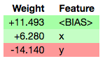
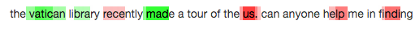

Overview
========

Installation
------------

ELI5 works in Python 2.7 and Python 3.4+. Currently it requires
scikit-learn 0.18+. You can install ELI5 using pip::

    pip install eli5

or using::

    conda install -c conda-forge eli5

Features
--------

ELI5_ is a Python package which helps to debug machine learning
classifiers and explain their predictions. It provides support for the
following machine learning frameworks and packages:

* :ref:`library-scikit-learn`. Currently ELI5 allows to explain weights
  and predictions of scikit-learn linear classifiers and regressors,
  print decision trees as text or as SVG, show feature importances
  and explain predictions of decision trees and tree-based ensembles.

  Pipeline and FeatureUnion are supported.

  ELI5 understands text processing utilities from scikit-learn and can
  highlight text data accordingly. It also allows to debug scikit-learn
  pipelines which contain HashingVectorizer, by undoing hashing.

* :ref:`library-xgboost` - show feature importances and explain predictions
  of XGBClassifier, XGBRegressor and xgboost.Booster.

* :ref:`library-lightgbm` - show feature importances and explain predictions
  of LGBMClassifier and LGBMRegressor.
 
* :ref:`library-catboost` - show feature importances of CatBoostClassifier and CatBoostRegressor. 

* :ref:`library-lightning` - explain weights and predictions of lightning
  classifiers and regressors.

* :ref:`library-sklearn-crfsuite`. ELI5 allows to check weights of
  sklearn_crfsuite.CRF models.

ELI5 also implements several algorithms for inspecting black-box models
(see :ref:`eli5-black-box`):

* :ref:`TextExplainer <lime-tutorial>` allows to explain predictions
  of any text classifier using :ref:`LIME <eli5-lime>` algorithm
  (Ribeiro et al., 2016). There are utilities for using LIME with non-text
  data and arbitrary black-box classifiers as well, but this feature is
  currently experimental.
* :ref:`eli5-permutation-importance` method can be used to compute feature
  importances for black box estimators.

Explanation and formatting are separated; you can get text-based explanation
to display in console, HTML version embeddable in an IPython notebook
or web dashboards, JSON version which allows to implement custom
rendering and formatting on a client, and convert explanations to pandas
DataFrame objects.

.. _lightning: https://github.com/scikit-learn-contrib/lightning
.. _scikit-learn: https://github.com/scikit-learn/scikit-learn
.. _sklearn-crfsuite: https://github.com/TeamHG-Memex/sklearn-crfsuite
.. _ELI5: https://github.com/TeamHG-Memex/eli5
.. _xgboost: https://github.com/dmlc/xgboost

Basic Usage
-----------

There are two main ways to look at a classification or a regression model:

1. inspect model parameters and try to figure out how the model works
   globally;
2. inspect an individual prediction of a model, try to figure out why
   the model makes the decision it makes.

For (1) ELI5 provides :func:`eli5.show_weights` function; for (2)
it provides :func:`eli5.show_prediction` function.

If the ML library you're working with is supported then you usually
can enter something like this in the IPython Notebook::

    import eli5
    eli5.show_weights(clf)

and get an explanation like this:

.. note::
    Depending on an estimator, you may need to pass additional parameters
    to get readable results - e.g. a vectorizer used to prepare features
    for a classifier, or a list of feature names.

Supported arguments and the exact way the classifier is visualized depends
on a library.

To explain an individual prediction (2) use :func:`eli5.show_prediction`
function. Exact parameters depend on a classifier and on input data kind
(text, tabular, images). For example, you may get text highlighted like this
if you're using one of the scikit-learn_ vectorizers with char ngrams:

To learn more, follow the :ref:`Tutorials`, check example IPython
`notebooks <https://github.com/TeamHG-Memex/eli5/tree/master/notebooks>`_
and read documentation specific to your framework in the
:ref:`supported-libraries` section.

Why?
----

For some of classifiers inspection and debugging is easy, for others
this is hard. It is not a rocket science to take coefficients
of a linear classifier, relate them to feature names and show in
an HTML table. ELI5 aims to handle not only simple cases,
but even for simple cases having a unified API for inspection has a value:

* you can call a ready-made function from ELI5 and get a nicely formatted
  result immediately;
* formatting code can be reused between machine learning frameworks;
* 'drill down' code like feature filtering or text highlighting can be reused;
* there are lots of gotchas and small differences which ELI5 takes care of;
* algorithms like :ref:`LIME <eli5-lime>`
  (`paper <http://arxiv.org/abs/1602.04938>`_) try to explain a black-box
  classifier through a locally-fit simple, interpretable classifier.
  It means that with each additional supported "simple" classifier/regressor
  algorithms like LIME are getting more options automatically.

Architecture
------------

In ELI5 "explanation" is separated from output format:
:func:`eli5.explain_weights` and :func:`eli5.explain_prediction`
return :class:`~.Explanation` instances; then functions from
:mod:`eli5.formatters` can be used to get HTML, text, dict/JSON
or pandas DataFrame representation of the explanation.

It is not convenient to do that all when working interactively in IPython
notebooks, so there are :func:`eli5.show_weights` and
:func:`eli5.show_prediction` functions which do explanation and formatting
in a single step.

Explain functions are not doing any work by themselves; they call
a concrete implementation based on estimator type.
So e.g. :func:`eli5.explain_weights` calls
:func:`eli5.sklearn.explain_weights.explain_linear_classifier_weights`
if ``sklearn.linear_model.LogisticRegression`` classifier is passed
as an estimator.
